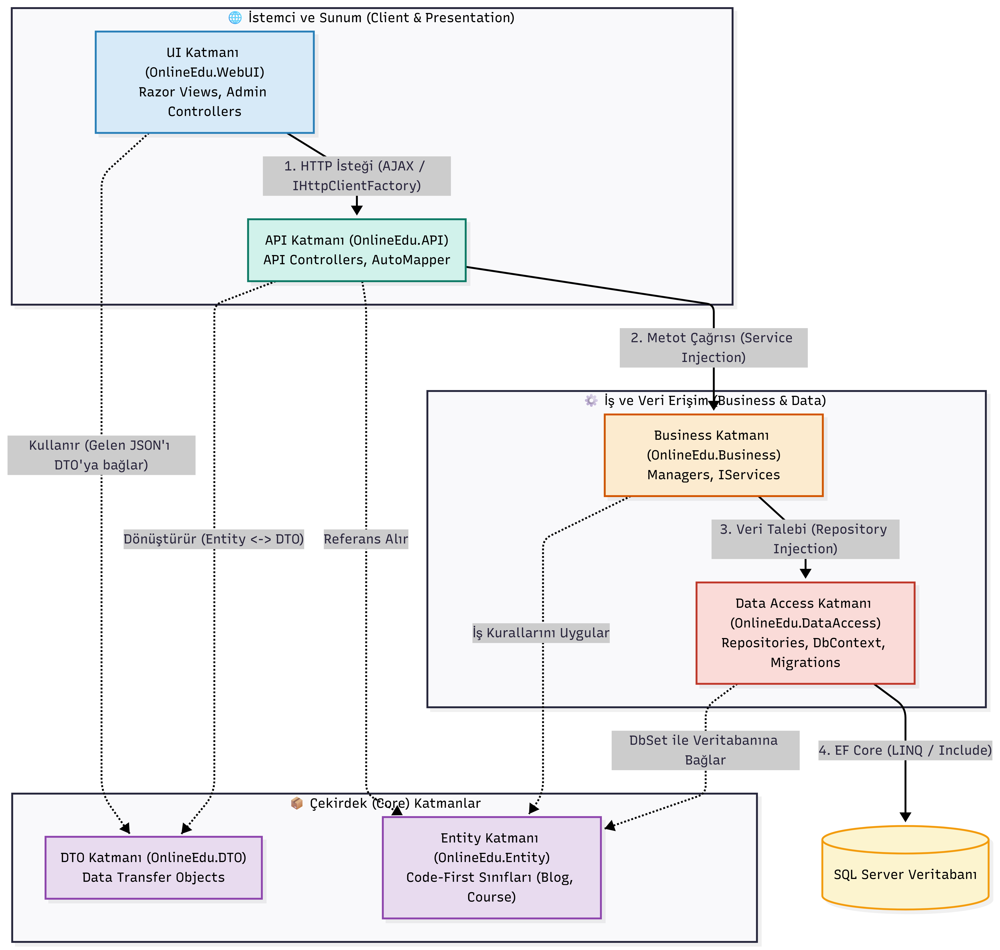

# 🎓 OnlineEdu - Çevrimiçi Eğitim Platformu

OnlineEdu, modern yazılım mimarisi standartlarına uygun olarak geliştirilmiş, API tabanlı ve çok katmanlı (N-Tier) bir çevrimiçi eğitim ve içerik yönetim sistemidir. Proje, yönetim (Admin) panelinden kurs, kategori ve blog işlemlerinin tam operasyonel olarak yönetilebilmesini sağlar.

## 📊 Mimari Bağımlılık ve Veri Akış Diyagramı

Projenin katmanlar arası bağımlılık zinciri ve HTTP veri akış şeması aşağıda görselleştirilmiştir:

---

## 🏗️ Proje Mimarisi ve Katmanlar

Proje, **Code-First** yaklaşımıyla tasarlanmış ve gevşek bağlılığı (Loose Coupling) garanti altına alan **6 Katmanlı (N-Tier)** bir mimari üzerine inşa edilmiştir:

* **`OnlineEdu.Entity` (Çekirdek Katmanı):** Veritabanı tablolarının şablonunu oluşturan saf C# sınıfları (`Blog`, `Course`, `CourseCategory` vb.) yer alır.
* **`OnlineEdu.DTO` (Veri Taşıma Katmanı):** Katmanlar arasında veri taşırken güvenliği ve performansı optimize eden, istemciye sadece gerekli alanları açan DTO yapıları bulunur.
* **`OnlineEdu.DataAccess` (Veri Erişim Katmanı):** Entity Framework Core ve SQL Server bağlantı köprüsüdür. **Generic Repository Pattern** mimarisinin yanı sıra ilişkili tabloları birleştiren (Eager Loading / `Include`) **Custom Repository** yapılarını barındırır.
* **`OnlineEdu.Business` (İş Mantığı Katmanı):** Projenin beynidir. Veri erişim katmanından gelen verileri doğrular, iş kurallarını (Business Logic) uygular ve servis mimarisiyle üst katmanlara sunar.
* **`OnlineEdu.API` (Servis Katmanı):** İş katmanından aldığı verileri dış dünyaya **JSON** formatında güvenli bir şekilde sunan RESTful API katmanıdır.
* **`OnlineEdu.WebUI` (Sunum Katmanı):** Kullanıcı ve Admin arayüzüdür. **Razor Views**, Controllers ve gelişmiş JavaScript (SweetAlert2) entegrasyonları ile tamamen asenkron veri tüketimi yapar.

---

## 🛠️ Öne Çıkan Teknik Özellikler

* **IHttpClientFactory (Named Client):** WebUI katmanında API ile haberleşirken performans kayıplarını ve soket tükenmesini (Socket Exhaustion) önlemek amacıyla isimlendirilmiş merkezi bir client yönetimi (`EduClient`) kullanılmıştır.
* **AutoMapper Entegrasyonu:** Katmanlar arası geçişlerde `Entity <-> DTO` dönüşümleri manuel esleme ameleliğinden kurtarılarak, otomatik ve tip güvenli (Type-Safe) bir şekilde konfigüre edilmiştir.
* **Gelişmiş UI Entegrasyonu & SweetAlert2:** Admin arayüzündeki kritik CRUD (Ekleme, Güncelleme, Silme) süreçleri, kullanıcı dostu asenkron onay pencereleriyle (AJAX tabanlı SweetAlert2) donatılarak kesintisiz bir kullanıcı deneyimi sunar.

---

## 🚀 Teknolojiler ve Araçlar

* **Backend:** .NET 8 / ASP.NET Core Web API & MVC
* **ORM / Veritabanı:** Entity Framework Core, MS SQL Server (Code-First Migration)
* **Eşleme / Haberleşme:** AutoMapper, IHttpClientFactory (RESTful API Consumption)
* **Front-End / UI:** Razor HTML, CSS, JavaScript, Bootstrap, SweetAlert2